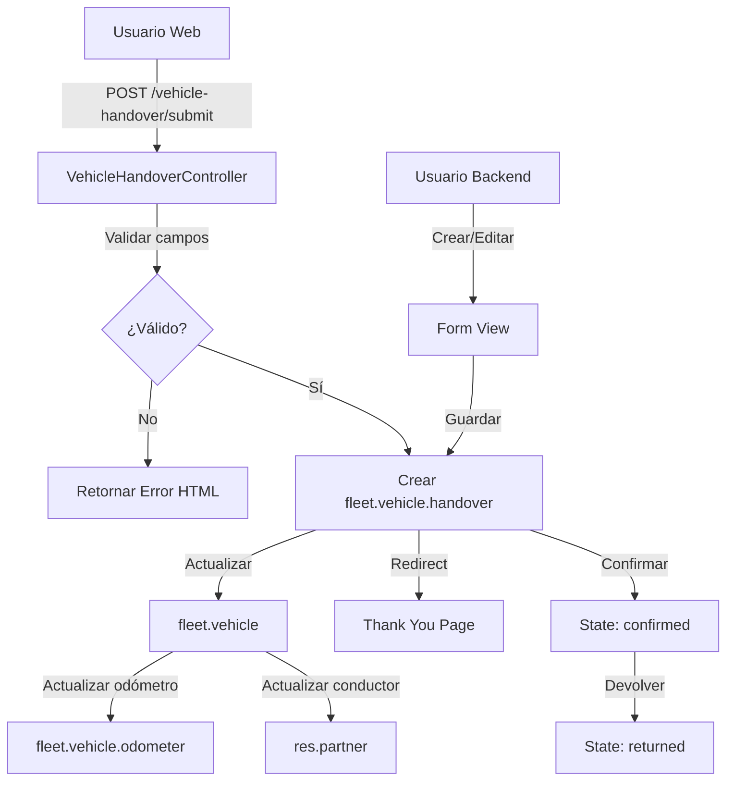

# Modulo Lubricar - Sistema de Entrega de Vehículos

## 📋 Descripción

**modulo_lubricar** es un módulo de Odoo que gestiona la entrega formal de vehículos a conductores con un sistema completo de inspección y checklist. El módulo permite registrar el estado detallado de múltiples sistemas del vehículo al momento de la entrega, generando un registro auditable del estado del vehículo.

- **Repositorio**: https://github.com/intaky-dev/modulo_lubricar
- **Tipo**: Módulo Odoo (Fork)
- **Categoría**: Fleet Management
- **Versión**: 1.0
- **Dependencias**: base, fleet, mail, website

## 🏗️ Arquitectura del Módulo

### Modelo Principal: `fleet.vehicle.handover`

El módulo crea un nuevo modelo de datos que gestiona las entregas de vehículos:

```
fleet.vehicle.handover
├── Información básica
│   ├── name (secuencia automática)
│   ├── driver_id (conductor)
│   ├── vehicle_id (vehículo)
│   ├── handover_date (fecha de entrega)
│   ├── odometer (lectura de odómetro)
│   └── personal_equipo (personal)
│
├── Sistema Eléctrico (8 campos)
│   ├── Luces altas/bajas
│   ├── Luces de giro (traseras/delanteras)
│   ├── Luces de freno
│   ├── Luces de marcha atrás
│   ├── Balizas intermitentes
│   └── Alarma acústica de retroceso
│
├── Carrocería (6 campos)
│   ├── Parabrisas
│   ├── Puertas
│   ├── Espejo retrovisor
│   ├── Frenos
│   ├── Freno de estacionamiento
│   └── Otros
│
├── Interior (2 campos)
│   ├── Limpieza
│   └── Otros
│
├── Elementos de Seguridad (7 campos)
│   ├── Extintor
│   ├── Balizas triángulo
│   ├── Linterna
│   ├── Pala
│   ├── Cadenas
│   ├── Chaleco reflectivo
│   └── Velas
│
├── Ruedas (5 campos)
│   ├── Cubiertas
│   ├── Ajuste (tuercas/bulones)
│   ├── Rueda de auxilio
│   ├── Checkpoint rueda
│   └── Otros
│
├── Accesorios (3 campos)
│   ├── Llave de ruedas
│   ├── Crique mecánico
│   └── Otros
│
├── Documentación (3 campos)
│   ├── Cédula verde
│   ├── VTV (Verificación Técnica)
│   └── Seguro
│
└── Estado y Seguimiento
    ├── state (draft/confirmed/returned)
    ├── has_issues (campo computado)
    └── notes (notas adicionales)
```

### Estados de Inspección

Cada elemento del checklist puede tener uno de estos estados:

- **N** - Normal: Funcionando correctamente
- **Co** - Corregir: Necesita corrección menor
- **F** - Faltante: Elemento faltante
- **V** - Verificar: Requiere verificación adicional
- **R** - Reparar: Necesita reparación
- **L** - Limpiar: Requiere limpieza
- **Ca** - Cambiar: Debe ser reemplazado
- **Nc** - No Corresponde: No aplica

## 🔧 Componentes del Módulo

### 1. Modelos (`/models`)

#### `fleet_vehicle_handover.py` (180 líneas)

Modelo principal con lógica de negocio:

```python
class FleetVehicleHandover(models.Model):
    _name = 'fleet.vehicle.handover'
    _inherit = ['mail.thread', 'mail.activity.mixin']

    # Método create sobrescrito
    def create(self, vals_list):
        # - Asigna secuencia automática
        # - Actualiza odómetro del vehículo
        # - Actualiza conductor del vehículo
        # - Normaliza valores por defecto

    # Campo computado para detectar problemas
    @api.depends(...)
    def _compute_has_issues(self):
        # Verifica si algún elemento != 'N'

    # Métodos de acción
    def action_confirm(self):  # Confirma la entrega
    def action_return(self):   # Marca como devuelto
```

**Características especiales**:
- Hereda de `mail.thread` para chatter/mensajería
- Hereda de `mail.activity.mixin` para actividades
- Tracking en campos clave (driver_id, vehicle_id, state)
- Secuencia automática para referencias
- Actualización automática del vehículo al crear entrega

#### `ir_http.py` (73 líneas)

Manejo de errores HTTP personalizados:

```python
class Http(models.AbstractModel):
    _inherit = 'ir.http'

    @classmethod
    def _dispatch(cls, endpoint):
        # Captura errores de vistas faltantes
        # Genera páginas de error HTML simples
```

### 2. Controladores (`/controllers`)

#### `controllers.py` (275 líneas)

Tres clases de controladores:

**VehicleHandoverController**:
- `/vehicle-handover` - Formulario público
- `/vehicle-handover/submit` - Procesamiento del envío

**VehicleHandoverAPI**:
- `/vehicle_handover/api/drivers` - API JSON de conductores
- `/vehicle_handover/api/vehicles` - API JSON de vehículos

**WebsiteVehicleHandover**:
- `/vehicle-handover/thank-you` - Página de confirmación

**Validaciones implementadas**:
- Campos requeridos: driver_id, vehicle_id, handover_date, odometer
- Verificación de seguridad: el driver_id enviado debe coincidir con el usuario actual
- Valores por defecto: todos los campos de checklist default a 'N'

### 3. Vistas (`/views`)

- **fleet_vehicle_handover_views.xml**: Vistas backend (form, tree, search)
- **fleet_vehicle_handover_website.xml**: Formulario web público con tabs
- **vehicle_handover_assets.xml**: Assets CSS/JS

### 4. Seguridad (`/security`)

- **driver_groups.xml**: Grupo de seguridad "Vehicle Handover User"
- **ir.model.access.csv**: Permisos de acceso al modelo

### 5. Datos (`/data`)

- **ir_sequence_data.xml**: Secuencia para referencias (ej: VH/2024/0001)
- **fleet_category.xml**: Categorías de flota predefinidas

## 💻 Uso del Módulo

### Backend - Gestión de Entregas

1. **Acceder al menú**:
   ```
   Fleet > Operations > Vehicle Handovers
   ```

2. **Crear nueva entrega**:
   - Click en "Crear"
   - Seleccionar conductor y vehículo
   - Ingresar odómetro y fecha
   - Completar checklist por pestañas:
     - Sistema Eléctrico
     - Carrocería
     - Interior
     - Elementos de Seguridad
     - Ruedas
     - Accesorios
     - Documentación
   - Guardar

3. **Flujo de estados**:
   ```
   Draft → Confirmed → Returned
   ```

### Frontend - Formulario Público

1. **Acceder al formulario**:
   ```
   https://tuodoo.com/vehicle-handover
   ```

2. **Completar formulario**:
   - El conductor se pre-selecciona (usuario actual)
   - Seleccionar vehículo
   - Completar fecha y odómetro
   - Revisar checklist completo
   - Enviar

3. **Confirmación**:
   - Se crea registro en estado "draft"
   - Redirección a página de agradecimiento

## 🔒 Seguridad

### Validaciones del Controlador

```python
# Validación de campos requeridos
if not post.get('driver_id'):
    missing_fields.append('Conductor')
# ... más validaciones

# Verificación anti-manipulación
submitted_driver_id = int(post.get('driver_id'))
real_driver_id = request.env.user.partner_id.id

if submitted_driver_id != real_driver_id:
    # Rechazar y mostrar error
```

### Permisos de Acceso

- Grupo: `group_vehicle_handover_user`
- Permisos: create, read, write, unlink (según configuración)

## 📦 Instalación

### Requisitos Previos

- Odoo 14.0+ (compatible con versiones superiores)
- Módulo `fleet` instalado
- Módulo `website` instalado

### Pasos de Instalación

```bash
# 1. Clonar el repositorio
cd /path/to/odoo/addons
git clone https://github.com/intaky-dev/modulo_lubricar.git

# 2. Actualizar lista de módulos
# En Odoo: Apps > Update Apps List

# 3. Instalar módulo
# En Odoo: Apps > Search "Modulo Lubricar" > Install
```

### Verificación

```python
# Verificar instalación en shell de Odoo
env['ir.module.module'].search([('name', '=', 'modulo_lubricar')])
# Debe retornar el módulo con state='installed'
```

## 🧪 Testing

El módulo incluye tres niveles de pruebas:

### Pruebas Unitarias

Ubicación: `/tests/test_fleet_vehicle_handover.py`

Cubren:
- Creación de registros
- Validación de campos
- Cálculo de has_issues
- Transiciones de estado
- Secuencias automáticas

### Pruebas de Integración

Ubicación: `/tests/test_integration.py`

Cubren:
- Integración con módulo fleet
- Actualización de vehículos
- Chatter y actividades
- Permisos de seguridad

### Pruebas E2E

Ubicación: `/tests/test_e2e.py`

Cubren:
- Flujo completo web
- Envío de formularios
- Validaciones HTTP
- Redirecciones

**Ejecutar pruebas**:
```bash
# Todas las pruebas
odoo-bin -d test_db -i modulo_lubricar --test-enable --stop-after-init

# Pruebas específicas
odoo-bin -d test_db --test-tags modulo_lubricar
```

## 🐛 Troubleshooting

### Error: "View 'website.http_error' not found"

**Solución**: El módulo incluye manejo de errores personalizado en `ir_http.py` que genera páginas HTML simples cuando faltan las vistas estándar.

### Error: "Campos requeridos faltantes"

**Causa**: Formulario enviado sin campos obligatorios.

**Solución**: Verificar que el formulario incluye:
- driver_id
- vehicle_id
- handover_date
- odometer

### Error: "Conductor inválido"

**Causa**: Intento de manipular driver_id en el POST.

**Solución**: El driver_id debe coincidir con el usuario autenticado. Esto es una medida de seguridad.

### Problemas con secuencia

**Síntoma**: Referencias aparecen como "New" en lugar de "VH/2024/0001"

**Solución**:
```python
# Verificar secuencia existe
env['ir.sequence'].search([('code', '=', 'fleet.vehicle.handover')])

# Recrear si es necesario
# Actualizar módulo: Apps > Modulo Lubricar > Upgrade
```

## 📊 Casos de Uso

### 1. Entrega de Vehículo Nuevo

```
Escenario: Conductor recibe vehículo de la empresa
1. Responsable crea entrega en backend
2. Selecciona conductor y vehículo
3. Registra odómetro inicial
4. Completa checklist (todo en "Normal")
5. Confirma entrega
→ Vehículo asignado a conductor
→ Odómetro actualizado
```

### 2. Detección de Problemas en Entrega

```
Escenario: Vehículo tiene luces dañadas
1. Conductor accede a formulario web
2. Completa checklist
3. Marca "Luces bajas" como "Reparar"
4. Envía formulario
→ has_issues = True
→ Notificación al responsable de flota
→ Se genera actividad de reparación
```

### 3. Devolución de Vehículo

```
Escenario: Conductor devuelve vehículo
1. Responsable accede al registro existente
2. Revisa estado actual vs inicial
3. Click en "Devolver"
→ state = 'returned'
→ Vehículo disponible para nueva entrega
```

## 🔄 Flujo de Datos



## 📈 Mejoras Futuras Sugeridas

1. **Notificaciones automáticas**: Email al detectar has_issues=True
2. **Reportes PDF**: Generar documento imprimible de la entrega
3. **Firma digital**: Capturar firma del conductor
4. **Fotos**: Adjuntar fotos del estado del vehículo
5. **Dashboard**: Vista de estadísticas de entregas
6. **Alertas**: Notificar cuando hay elementos para reparar
7. **Histórico**: Ver entregas anteriores del mismo vehículo
8. **QR Code**: Generar QR para acceso rápido al formulario

## 📚 Referencias

- **Documentación Odoo**: https://www.odoo.com/documentation/14.0/
- **Módulo Fleet**: https://www.odoo.com/documentation/14.0/applications/fleet.html
- **Website Controllers**: https://www.odoo.com/documentation/14.0/developer/reference/addons/website.html
- **Repository original**: https://github.com/intaky-dev/modulo_lubricar

## 👥 Contribución

Este es un fork. Para contribuir:
1. Fork del repositorio
2. Crear rama feature
3. Commit cambios
4. Push a la rama
5. Crear Pull Request

## 📝 Notas Técnicas

### Modelo de Datos

- **Total de campos**: ~50 campos
- **Campos de checklist**: 38 campos (Selection)
- **Campos computados**: 1 (has_issues)
- **Campos relacionales**: 2 (driver_id, vehicle_id)

### Performance

- Índices en: driver_id, vehicle_id, state
- Campo computado `has_issues` no almacenado (store=False)
- Búsquedas optimizadas con dominios

### Compatibilidad

- Odoo 14.0+
- Python 3.6+
- PostgreSQL 10+

---

**Última actualización**: 2025-11-19
**Documentado por**: Claude Code Assistant
